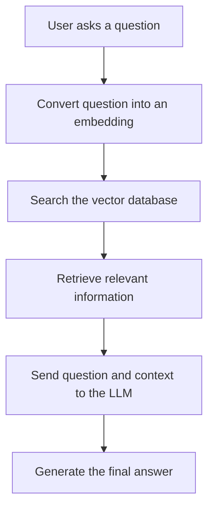

# RAG

RAG stands for **Retrieval-Augmented Generation**.

It is a technique that lets an AI answer questions using your own data—such as PDFs, documentation, database records, or previous call summaries—instead of relying only on its trained knowledge.

## How RAG Works



---

## What is Embedding in RAG?
An embedding is a numerical representation of text that helps a computer understand its meaning.  
For example:
```bash
"I like programming"
        ↓
[0.12, -0.45, 0.78, 0.31, ...]
```
An embedding model converts the sentence into a long list of numbers called a vector.  
In RAG:
- Your documents are divided into smaller chunks.
- Every chunk is converted into an embedding.
- These embeddings are stored in a vector database.
- The user’s question is also converted into an embedding.
- The system compares the question’s embedding with the stored embeddings.
- It retrieves chunks whose meaning is most similar.
