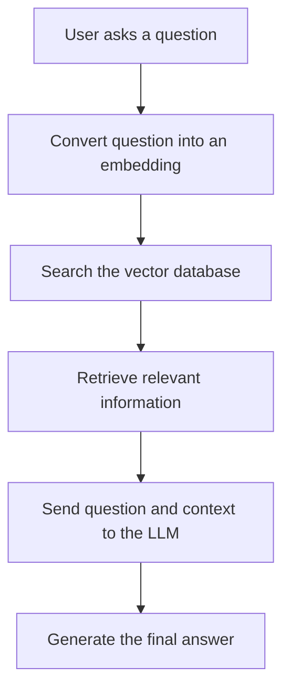

# RAG

RAG stands for **Retrieval-Augmented Generation**.

It is a technique that lets an AI answer questions using your own data—such as PDFs, documentation, database records, or previous call summaries—instead of relying only on its trained knowledge.

## How RAG Works

