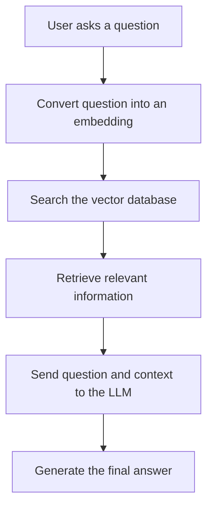
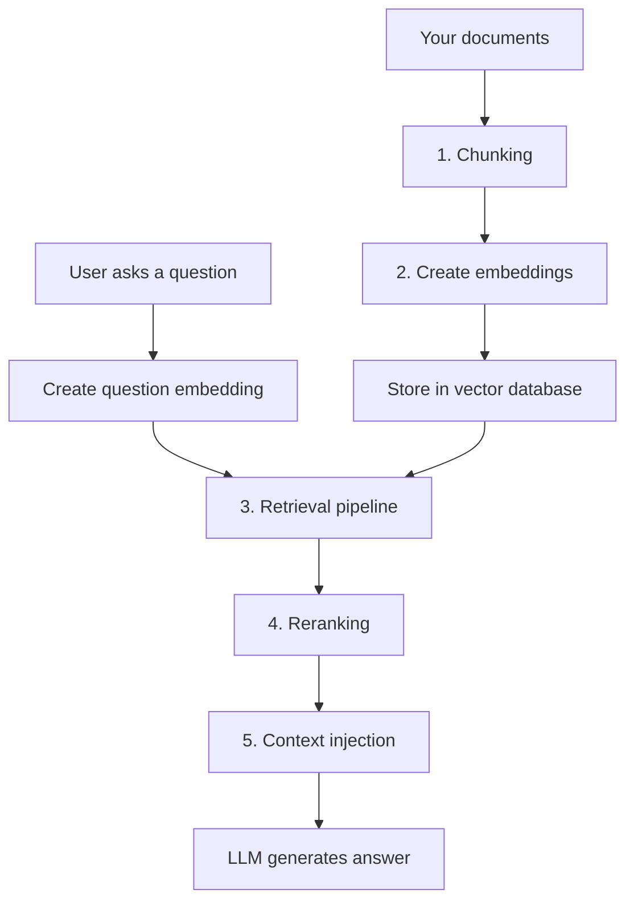

# RAG

RAG stands for **Retrieval-Augmented Generation**.

It is a technique that lets an AI answer questions using your own data—such as PDFs, documentation, database records, or previous call summaries—instead of relying only on its trained knowledge.

## How RAG Works



## These five things are used at different stages of a RAG system.



---

## 1. What is Chunking in RAG?
Chunking means splitting a large document into smaller pieces called chunks.  
For example, suppose you have a 100-page MDR API document. Instead of sending the complete document to the AI, you divide it into smaller sections:  
```
Complete API documentation
        ↓
Chunk 1: Authentication
Chunk 2: Fetch carriers
Chunk 3: Stop carrier calls
Chunk 4: Submit quote
```

Why is chunking needed?
- An LLM has a limited context window.
- Searching smaller chunks is more accurate.
- You send only relevant information to the LLM.
- It reduces token usage and cost.

---

## 2. What is Embedding in RAG?
An embedding is a numerical representation of text that helps a computer understand its meaning. Embed the Chunk, so after chunking embedding happens.  
For example:
```bash
"I like programming"
        ↓
[0.12, -0.45, 0.78, 0.31, ...]
```
An embedding model converts the sentence into a long list of numbers called a vector.  
In RAG:
- Your documents are divided into smaller chunks.
- Every chunk is converted into an embedding.
- These embeddings are stored in a vector database.
- The user’s question is also converted into an embedding.
- The system compares the question’s embedding with the stored embeddings.
- It retrieves chunks whose meaning is most similar.

---

## 3. Retrieval pipeline.
A retrieval pipeline is the complete process used to find relevant document chunks for a user’s question.
```
User question
      ↓
Create question embedding
      ↓
Search vector database
      ↓
Find similar chunk embeddings
      ↓
Return the most relevant chunks
```
Example:
```
User: "How do I prevent future carrier calls?"

Retrieved chunks:

1. "/voice/stop marks the carrier as do-not-call."
2. "Carriers with stop_call=true are excluded from dispatch."
```

## 4. Reranking.
The vector database returns chunks that are probably relevant, but their initial order may not be perfect.  
Reranking means checking the retrieved chunks more carefully and placing the most relevant ones first.  

A common approach is:
- Retrieve 20 possible chunks using fast vector search.
- Send those chunks and the question to a reranking model.
- Select the best 3–5 chunks.
- Pass only those chunks to the LLM.
This improves accuracy, but adds some latency and cost.
