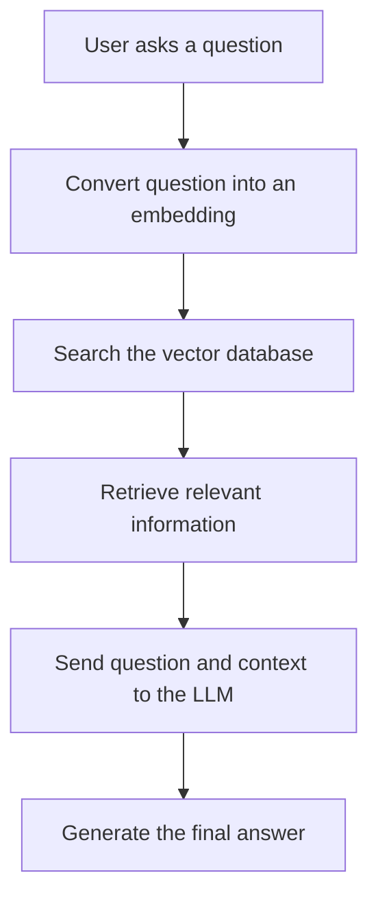

# RAG

RAG stands for **Retrieval-Augmented Generation**.

It is a technique that lets an AI answer questions using your own data—such as PDFs, documentation, database records, or previous call summaries—instead of relying only on its trained knowledge.

## How RAG Works




## What is Embedding in RAG?
An embedding is a numerical representation of text that helps a computer understand its meaning.  
For example:
```bash
"I like programming"
        ↓
[0.12, -0.45, 0.78, 0.31, ...]
```
